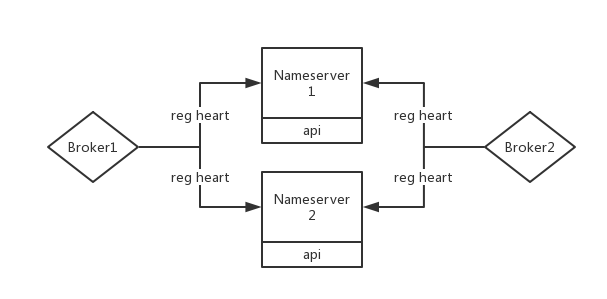

### Rocketmq Nameserver分析
##### 一、KV存储
存储数据结构如下，namespace下存储key，value（KVConfigManager.java）

```java
private final HashMap<String/* Namespace */, HashMap<String/* Key */, String/* Value */>> configTable
     = new HashMap<String, HashMap<String, String>>();
```

namespce如`NAMESPACE_ORDER_TOPIC_CONFIG`用来存储Topic的queue顺序定义

提供api：增加，删除，修改 KV


##### 二、Broker注册
Broker启动会注册到nameserver


```java
case RequestCode.REGISTER_BROKER:
    Version brokerVersion = MQVersion.value2Version(request.getVersion());
    if (brokerVersion.ordinal() >= MQVersion.Version.V3_0_11.ordinal()) {
        return this.registerBrokerWithFilterServer(ctx, request);
    } else {
        return this.registerBroker(ctx, request);
    }
```

`Nameserver` 收到`Broker`的注册信息后会保存`broker`所属集群，同时Broker会带上topic相关信息，如果这个Broker之前没有注册过，是新的broker，则会更新这个broker上所带的topic信息到nameserver中，另外，如果broker断线，他的心跳信息会被定时任务清除，会更新这个broker的心跳信息。代码如下：

```java
public RegisterBrokerResult registerBroker(
    final String clusterName,
    final String brokerAddr,
    final String brokerName,
    final long brokerId,
    final String haServerAddr,
    final TopicConfigSerializeWrapper topicConfigWrapper,//topic信息列表 map
    final List<String> filterServerList,
    final Channel channel) {
    RegisterBrokerResult result = new RegisterBrokerResult();
    try {
        try {
            this.lock.writeLock().lockInterruptibly();
			//加入集群
            Set<String> brokerNames = this.clusterAddrTable.get(clusterName);
            if (null == brokerNames) {
                brokerNames = new HashSet<String>();
                this.clusterAddrTable.put(clusterName, brokerNames);
            }
            brokerNames.add(brokerName);

            boolean registerFirst = false;
			//broker地址以及编号信息注册，为0表示master
            BrokerData brokerData = this.brokerAddrTable.get(brokerName);
            if (null == brokerData) {
                registerFirst = true;
                brokerData = new BrokerData();
                brokerData.setBrokerName(brokerName);
                HashMap<Long, String> brokerAddrs = new HashMap<Long, String>();
                brokerData.setBrokerAddrs(brokerAddrs);

                this.brokerAddrTable.put(brokerName, brokerData);
            }
            String oldAddr = brokerData.getBrokerAddrs().put(brokerId, brokerAddr);
            registerFirst = registerFirst || (null == oldAddr);
				//master 第一次注册 更新 queuedata
            if (null != topicConfigWrapper //
                && MixAll.MASTER_ID == brokerId) {
                if (this.isBrokerTopicConfigChanged(brokerAddr, topicConfigWrapper.getDataVersion())//
                    || registerFirst) {
                    ConcurrentHashMap<String, TopicConfig> tcTable =
                        topicConfigWrapper.getTopicConfigTable();
                    if (tcTable != null) {
                        for (Map.Entry<String, TopicConfig> entry : tcTable.entrySet()) {
                            this.createAndUpdateQueueData(brokerName, entry.getValue());
                        }
                    }
                }
            }
				//心跳信息
            BrokerLiveInfo prevBrokerLiveInfo = this.brokerLiveTable.put(brokerAddr,
                new BrokerLiveInfo(
                    System.currentTimeMillis(),
                    topicConfigWrapper.getDataVersion(),
                    channel,
                    haServerAddr));
            if (null == prevBrokerLiveInfo) {
                log.info("new broker registerd, {} HAServer: {}", brokerAddr, haServerAddr);
            }

            if (filterServerList != null) {
                if (filterServerList.isEmpty()) {
                    this.filterServerTable.remove(brokerAddr);
                } else {
                    this.filterServerTable.put(brokerAddr, filterServerList);
                }
            }

            if (MixAll.MASTER_ID != brokerId) {
                String masterAddr = brokerData.getBrokerAddrs().get(MixAll.MASTER_ID);
                if (masterAddr != null) {
                    BrokerLiveInfo brokerLiveInfo = this.brokerLiveTable.get(masterAddr);
                    if (brokerLiveInfo != null) {
                        result.setHaServerAddr(brokerLiveInfo.getHaServerAddr());
                        result.setMasterAddr(masterAddr);
                    }
                }
            }
        } finally {
            this.lock.writeLock().unlock();
        }
    } catch (Exception e) {
        log.error("registerBroker Exception", e);
    }

    return result;
}

```

##### 三、Broker心跳
Broker会定时上传心跳信息，同时Nameserver会启动定时任务10秒钟执行一次来清理没有上传心跳超过一定时间的Broker，被清理的Broker会下线，同时与Nameserver的连接会被关闭。

+ NameServer的清理，清理时间间隔：10s

```java
this.scheduledExecutorService.scheduleAtFixedRate(new Runnable() {

    @Override
    public void run() {
        NamesrvController.this.routeInfoManager.scanNotActiveBroker();
    }
}, 5, 10, TimeUnit.SECONDS);

```
清理代码如下，其中destroy方法会清理broker在集群中的信息，清理该broker上的filter信息，清理该broker的地址在broker name中，如果同一个broker name下面的address已经被完全清理空，则还会清理掉这个broker name下的topic路由信息，因为该topic没有副本可以发送或者消费消息。说明：同一个broker name下有master slave，master id为0

BROKER_CHANNEL_EXPIRED_TIME = 1000 * 60 * 2 2分钟

```java
public void scanNotActiveBroker() {
    Iterator<Entry<String, BrokerLiveInfo>> it = this.brokerLiveTable.entrySet().iterator();
    while (it.hasNext()) {
        Entry<String, BrokerLiveInfo> next = it.next();
        long last = next.getValue().getLastUpdateTimestamp();
        if ((last + BROKER_CHANNEL_EXPIRED_TIME) < System.currentTimeMillis()) {
            RemotingUtil.closeChannel(next.getValue().getChannel());
            it.remove();
            log.warn("The broker channel expired, {} {}ms", next.getKey(), BROKER_CHANNEL_EXPIRED_TIME);
            this.onChannelDestroy(next.getKey(), next.getValue().getChannel());
        }
    }
}
```
分析：如果一个broker server阻塞，没有发送心跳到nameserver，那么最多需要2分钟+client发现时间才能删除。

+ Broker心跳更新

会定时给nameserver注册来更新心跳信息


##### 四、Topic对外api

```java
public RemotingCommand processRequest(ChannelHandlerContext ctx, RemotingCommand request) throws RemotingCommandException {
        switch (request.getCode()) {
            case RequestCode.PUT_KV_CONFIG:
                return this.putKVConfig(ctx, request);
            case RequestCode.GET_KV_CONFIG:
                return this.getKVConfig(ctx, request);
            case RequestCode.DELETE_KV_CONFIG:
                return this.deleteKVConfig(ctx, request);
            case RequestCode.REGISTER_BROKER:
                Version brokerVersion = MQVersion.value2Version(request.getVersion());
                if (brokerVersion.ordinal() >= MQVersion.Version.V3_0_11.ordinal()) {
                    return this.registerBrokerWithFilterServer(ctx, request);
                } else {
                    return this.registerBroker(ctx, request);
                }
            case RequestCode.UNREGISTER_BROKER:
                return this.unregisterBroker(ctx, request);
            case RequestCode.GET_ROUTEINTO_BY_TOPIC:
                return this.getRouteInfoByTopic(ctx, request);
            case RequestCode.GET_BROKER_CLUSTER_INFO:
                return this.getBrokerClusterInfo(ctx, request);
            case RequestCode.WIPE_WRITE_PERM_OF_BROKER:
                return this.wipeWritePermOfBroker(ctx, request);
            case RequestCode.GET_ALL_TOPIC_LIST_FROM_NAMESERVER:
                return getAllTopicListFromNameserver(ctx, request);
            case RequestCode.DELETE_TOPIC_IN_NAMESRV:
                return deleteTopicInNamesrv(ctx, request);
            case RequestCode.GET_KVLIST_BY_NAMESPACE:
                return this.getKVListByNamespace(ctx, request);
            case RequestCode.GET_TOPICS_BY_CLUSTER:
                return this.getTopicsByCluster(ctx, request);
            case RequestCode.GET_SYSTEM_TOPIC_LIST_FROM_NS:
                return this.getSystemTopicListFromNs(ctx, request);
            case RequestCode.GET_UNIT_TOPIC_LIST:
                return this.getUnitTopicList(ctx, request);
            case RequestCode.GET_HAS_UNIT_SUB_TOPIC_LIST:
                return this.getHasUnitSubTopicList(ctx, request);
            case RequestCode.GET_HAS_UNIT_SUB_UNUNIT_TOPIC_LIST:
                return this.getHasUnitSubUnUnitTopicList(ctx, request);
            case RequestCode.UPDATE_NAMESRV_CONFIG:
                return this.updateConfig(ctx, request);
            case RequestCode.GET_NAMESRV_CONFIG:
                return this.getConfig(ctx, request);
            default:
                break;
        }
        return null;
    }

```
##### 五、其他
nameserver配置文件的更新提供了api，可以通过api更新配置，同时配置文件更新了会持久化到文件系统中，初次启动时会使用该配置文件。