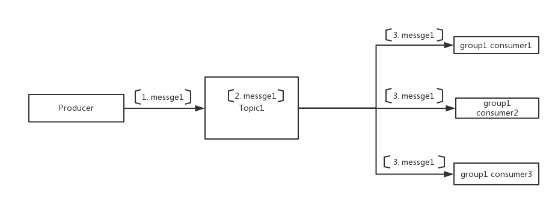

### 广播模式消费消息
####广播消息简介
广播消息表示的是生产者发送消息后，同一个group的消费者申明自己是广播模式来消费消息，这个group的所有消费者都将收到发送的每一条消息而不是自己订阅的局部队列queue。


* 发送消息和之前的方式一样

```java
DefaultMQProducer producer = new DefaultMQProducer("ProducerGroupName");

producer.start();

for (int i = 0; i < 10000000; i++){
    try {
        {
            Message msg = new Message("TopicTest",
                "TagA",
                "OrderID188",
                "Hello world".getBytes(RemotingHelper.DEFAULT_CHARSET));
            SendResult sendResult = producer.send(msg);
            System.out.printf("%s%n", sendResult);
        }

    } catch (Exception e) {
        e.printStackTrace();
    }
}
producer.shutdown();

```


* 广播接收消息消费

```java
DefaultMQPushConsumer consumer = new DefaultMQPushConsumer("please_rename_unique_group_name_1");

consumer.setConsumeFromWhere(ConsumeFromWhere.CONSUME_FROM_FIRST_OFFSET);

//set to broadcast mode
consumer.setMessageModel(MessageModel.BROADCASTING);

consumer.subscribe("TopicTest", "TagA || TagC || TagD");

consumer.registerMessageListener(new MessageListenerConcurrently() {

    @Override
    public ConsumeConcurrentlyStatus consumeMessage(List<MessageExt> msgs,
        ConsumeConcurrentlyContext context) {
        System.out.printf(Thread.currentThread().getName() + " Receive New Messages: " + msgs + "%n");
        return ConsumeConcurrentlyStatus.CONSUME_SUCCESS;
    }
});

consumer.start();
System.out.printf("Broadcast Consumer Started.%n");

```
#### 广播接收消息的可靠性问题
采用广播模式消费消息，如果消息消费失败，这条消息可能会丢失，对于一个group里面的同一个consumer来说。这个时候其他的consumer可能已经消费了这条消息。原因是消费者消费消息的时候如果遇到消息消费失败，广播模式是不处理失败的，消息的位点保存在本地，消息位点还会向前拉取更新的消息消费。